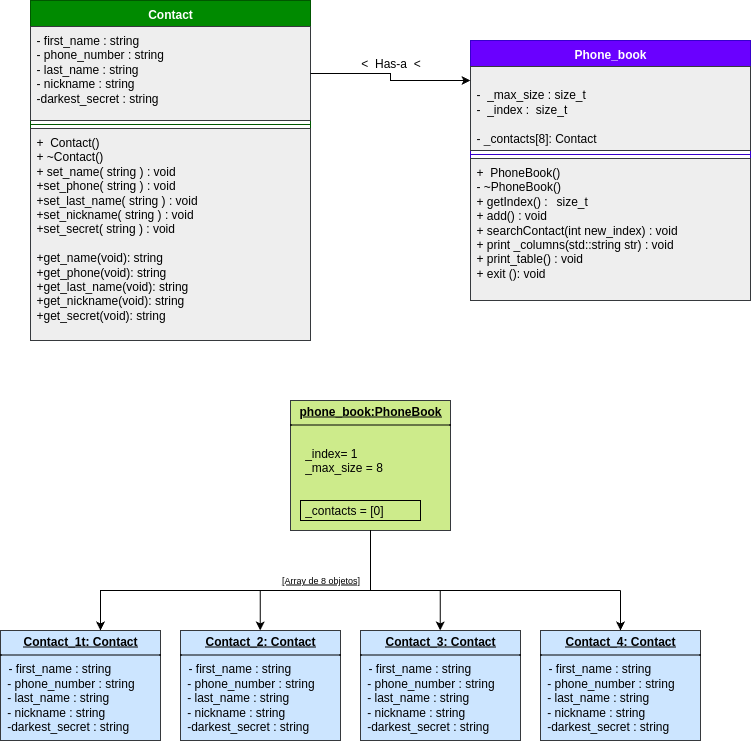
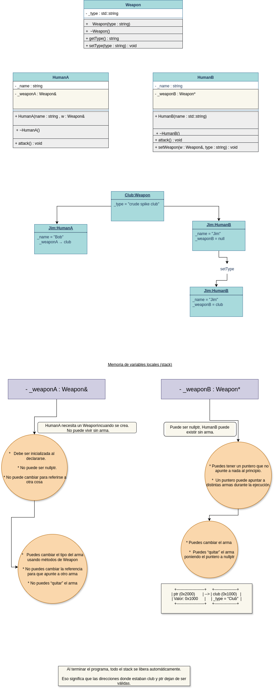
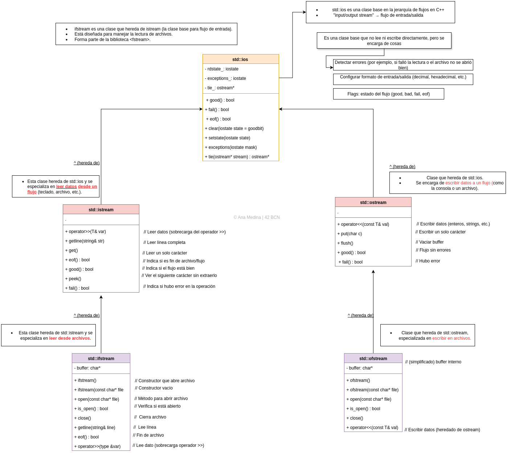
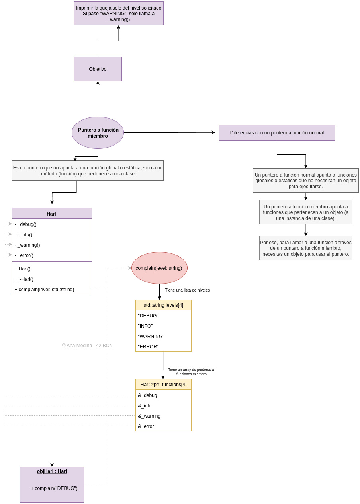

# 📘 Piscinas C++ – 42 Barcelona

Este repositorio contiene mis ejercicios y apuntes personales de la piscina de C++ en [42 Barcelona](https://42barcelona.com/).

Incluye los módulos:

- `cpp00` – Conceptos básicos y Phonebook  
- `cpp01` – Punteros, clases y composición

---

## 📦 cpp00 – Módulo básico

### 📦 ex00 – First contact with C++

#### 🎯 Objetivo:
- Familiarizarse con el entorno C++ básico y la compilación con `clang++`.
- Escribir el clásico programa `Hello World!`.

#### 🧠 Conceptos clave:
- Uso de `std::cout` y `std::endl`.
- Compilación y ejecución de programas simples.
- Introducción a las buenas prácticas en C++.

---

### 📦 ex01 – Phonebook

#### 🎯 Objetivo:
- Implementar una agenda telefónica básica en C++.
- Manejar la entrada del usuario y almacenar contactos.

#### 🧠 Conceptos clave:
- Uso de clases para representar un contacto.
- Gestión de arrays estáticos o dinámicos de objetos.
- Métodos para añadir, buscar y mostrar contactos.
- Validación y control de entradas del usuario.

---

## 📦 cpp01 – Módulo avanzado

### 📦 ex00 – Pointers and References

#### 🎯 Objetivo:
- Entender la diferencia entre punteros (`*`) y referencias (`&`) en C++.
- Ver cómo acceden a la misma dirección de memoria.

#### 🧠 Conceptos clave:
- Un **puntero** puede cambiar y puede ser `nullptr`.
- Una **referencia** debe estar inicializada y no puede cambiar de objeto.
- Ambas permiten modificar el valor original al que apuntan.

---

### 📦 ex01 – Zombie class

#### 🎯 Objetivo:
- Practicar el uso de clases, memoria dinámica y funciones miembro.

#### 🧠 Conceptos clave:
- Crear objetos en el **stack** y en el **heap** (`new`, `delete`).
- Implementar constructores, métodos (`announce`) y destructores.
- Importancia del destructor para liberar memoria dinámica.

#### ✔️ Buenas prácticas:
- Si usas `new`, asegúrate de usar `delete`.
- El destructor debe anunciar la destrucción del objeto (para seguimiento).

---

### 📦 ex02 – Zombie Horde

#### 🎯 Objetivo:
- Crear una horda de zombies en memoria dinámica.
- Gestionar un array dinámico de objetos.

#### 🧠 Conceptos clave:
- Uso de arrays dinámicos con punteros.
- Gestión de memoria con `new[]` y `delete[]`.
- Llamada a métodos de cada objeto en la horda.

---

### 📦 ex03 – HumanA vs HumanB y Weapon

#### 🎯 Objetivo:
- Comprender la diferencia entre componer clases con **referencias** vs **punteros**.
- Entender cuándo usar cada uno.

#### 👤 HumanA:
- Recibe un `Weapon&` (referencia) en su constructor.
- El arma debe existir **antes** y **no puede cambiarse ni eliminarse**.
- No puede existir sin un arma.

#### 👤 HumanB:
- Tiene un `Weapon*` (puntero) que se puede **añadir más tarde** o dejar vacío.
- Puede cambiar de arma en cualquier momento con `setWeapon`.
- Puede existir sin arma.

#### 🧠 Conceptos clave:
- Una **referencia** es más segura si el objeto siempre debe tener un arma.
- Un **puntero** es más flexible, pero requiere comprobaciones (`nullptr`).
- Este ejercicio demuestra **diferencias de diseño en composición de clases**.

---

### 📦 ex04 – Sed is for losers

#### 🎯 Objetivo:
- Crear un programa que lea un archivo de texto y reemplace todas las ocurrencias de una palabra por otra.

#### 🧠 Conceptos clave:
- Uso de **streams en C++**: `ifstream`, `ofstream`.
- Manipulación de **strings** con `find`, `replace`, `substr`.
- Crear un nuevo archivo de salida con el contenido modificado.

#### ✔️ Buenas prácticas:
- Comprobar que el archivo original se abrió correctamente.
- Validar que los argumentos no estén vacíos.
- Asegurarse de no entrar en bucles infinitos al reemplazar.

---

### 📦 ex05 – Harl complains

#### 🎯 Objetivo:
- Crear una clase `Harl` que tenga diferentes niveles de queja (`DEBUG`, `INFO`, `WARNING`, `ERROR`) y ejecute una función distinta para cada nivel.

#### 🧠 Conceptos clave:
- Uso de funciones miembro privadas que representan cada nivel.
- Implementar un método público `complain(string level)` que actúe como **dispatcher**.
- Uso de arrays de punteros a funciones miembro.

#### ✔️ Buenas prácticas:
- Mantener limpio el código evitando múltiples `if-else`.
- Usar `typedef` o `using` para punteros a funciones para mejor legibilidad.

---

### 📦 ex06 – Harl filter (opcional)

#### 🎯 Objetivo:
- Filtrar las quejas de `Harl` según un nivel dado, imprimiendo solo desde ese nivel hacia arriba.

#### 🧠 Conceptos clave:
- Implementar un sistema de **prioridades** de logging.
- Filtrado de los niveles usando un array de strings y un índice de comparación.
- El nivel introducido por el usuario determina a partir de qué quejas se imprimen.

---

> `Made with 💙 at 42BCN`  
> `© Ana Medina – 42 Barcelona`

