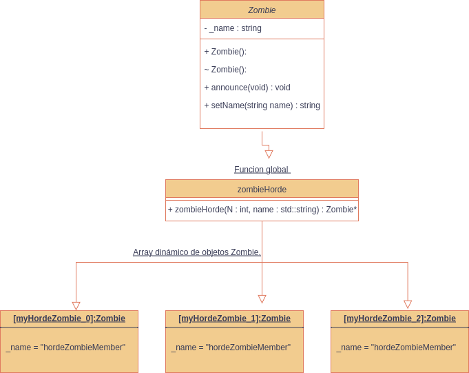

# cpp-module-00

## Diagrama UML

# 🧠 C++ Module 01 – Resumen teórico por ejercicios

## 📦 ex00 – Pointers and References

### Objetivo:
- Entender la diferencia entre punteros (`*`) y referencias (`&`) en C++.
- Ver cómo acceden a la misma dirección de memoria.

### Conceptos clave:
- Un **puntero** puede cambiar y puede ser `nullptr`.
- Una **referencia** debe estar inicializada y no puede cambiar de objeto.
- Ambas permiten modificar el valor original al que apuntan.

---

## 📦 ex01 – Zombie class

### Objetivo:
- Practicar el uso de clases, memoria dinámica y funciones miembro.

### Conceptos clave:
- Crear objetos en el **stack** y en el **heap** (`new`, `delete`).
- Implementar constructores, métodos (`announce`) y destructores.
- Importancia del destructor para liberar memoria dinámica.

### Buenas prácticas:
- Si usas `new`, asegúrate de usar `delete`.
- El destructor debe anunciar la destrucción del objeto (para seguimiento).

---

## 📦 ex02 – HumanA vs HumanB y Weapon

### Objetivo:
- Comprender la diferencia entre componer clases con **referencias** vs **punteros**.
- Entender cuándo usar cada uno.

### HumanA:
- Recibe un `Weapon&` (referencia) en su constructor.
- El arma debe existir **antes** y **no puede cambiarse ni eliminarse**.
- No puede existir sin un arma.

### HumanB:
- Tiene un `Weapon*` (puntero) que se puede **añadir más tarde** o dejar vacío.
- Puede cambiar de arma en cualquier momento con `setWeapon`.
- Puede existir sin arma.

### Conceptos clave:
- Una referencia es más segura si el objeto siempre debe tener un arma.
- Un puntero es más flexible, pero requiere comprobaciones (`nullptr`).
- Este ejercicio demuestra **diferencias de diseño en composición de clases**.

---

## 📦 ex03 – 

*(Este puede variar según la versión del módulo. Puede ser revisar const correctness, copiar objetos, etc.)*

---

## 📌 Conclusión general del módulo

Este módulo refuerza conceptos fundamentales de C++:

- Diferencias entre stack y heap
- Gestión de memoria manual
- Punteros vs referencias
- Composición de clases
- Constructores, destructores y const correctness

